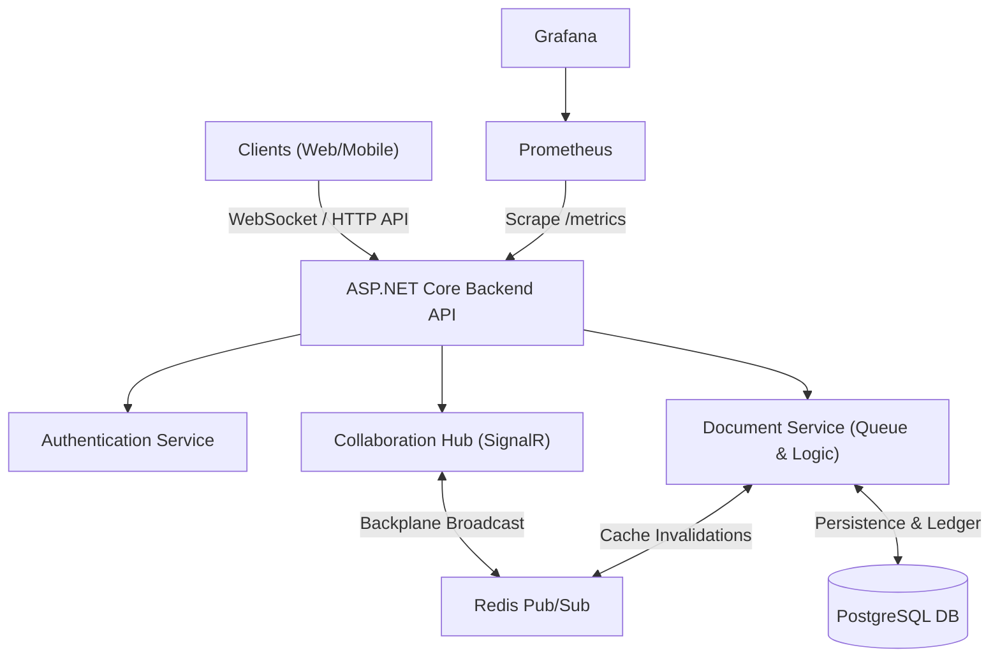

# Real-Time Collaborative Document System (Mini Google Docs Backend)

A **production-style real-time collaborative document backend** built with **ASP.NET Core, WebSockets (SignalR), Redis, and PostgreSQL**.

This project demonstrates how modern collaborative applications like **Google Docs or Notion** handle **real-time editing, concurrent users, and distributed systems**.

The goal of this project is to explore **backend engineering concepts** such as:

* Real-time communication
* Distributed systems
* Conflict resolution
* Event-driven architecture
* Horizontal scalability

---

# Features

### Core Features

* Real-time collaborative editing
* Multi-user document sessions
* WebSocket-based updates
* Authentication & authorization
* Document CRUD API
* Operation-based editing
* Edit history tracking

### Advanced Features

* Conflict resolution (Operational Transform)
* Redis pub/sub for distributed synchronization
* Horizontal server scaling
* Document version history
* Rate limiting
* Structured logging
* Load testing support
* Dockerized infrastructure

---

# System Architecture



# API Documentation

The Web API uses standard REST architecture and is fully documented via Swagger OpenAPI.
When running the development server, navigate to `/swagger/index.html` to test endpoints like:
- `POST /api/auth/register`
- `POST /api/auth/login`
- `GET /api/document/{id}`
- `GET /api/document/{id}/history`
- `POST /api/document/{id}/restore`

# Scaling Strategy

1.  **Stateless API Instances:** The ASP.NET Core API is containerized and maintains zero local lock state.
2.  **Horizontal Scale Out:** Spin up multiple `collabdocs` API containers using Docker Swarm or Kubernetes.
3.  **Redis Interconnection:** The SignalR Redis Backplane forces all instances to share WebSockets transparently, handling thousands of concurrent users in parallel, while Redis Pub/Sub concurrently invalidates in-memory caches instantly across all nodes.
4.  **Database Throttling Elimination:** Heavy `SELECT` queries are mitigated using `IMemoryCache` on active editors, cutting database load drastically.

### Flow of an Edit Operation

1. User edits a document.
2. Client sends edit operation through **WebSocket**.
3. Server validates and transforms the operation.
4. Operation is applied to document state.
5. Operation is broadcast to other users.
6. Operation is saved to the database.

---

# ⚙Tech Stack

### Backend

* **ASP.NET Core (.NET 10)**
* **C#**

### Real-Time Communication

* **SignalR (WebSockets)**

### Databases

* **PostgreSQL** – persistent storage
* **Redis** – pub/sub and distributed synchronization

### Infrastructure

* **Docker**
* **Docker Compose**

### Observability

* **Serilog** – logging
* **Prometheus** – metrics
* **Grafana** – monitoring

### Testing

* **k6 / Locust** – load testing

---

# Project Structure

```
CollabDocs
│
├── Api
│   ├── Controllers
│   ├── Hubs
│
├── Domain
│   ├── Models
│   ├── Enums
│
├── Services
│   ├── DocumentService
│   ├── AuthService
│
├── Infrastructure
│   ├── Database
│   ├── Redis
│
├── Docker
│
└── Tests
```

---

# Database Schema

### Users

```
User
- id
- email
- password_hash
- created_at
```

### Documents

```
Document
- id
- title
- owner_id
- created_at
```

### Permissions

```
DocumentPermission
- id
- document_id
- user_id
- role (owner/editor/viewer)
```

### Document Versions

```
DocumentVersion
- id
- document_id
- content
- version_number
```

### Edit Operations

```
DocumentEdit
- id
- document_id
- user_id
- operation_type
- position
- content
- timestamp
```

---

# Authentication

Authentication is implemented using **JWT tokens**.

Endpoints:

```
POST /auth/register
POST /auth/login
```

Authorization uses **role-based access control (RBAC)**:

Roles:

* Owner
* Editor
* Viewer

---

# Real-Time Collaboration

The system uses **SignalR** for WebSocket communication.

### Hub

```
DocumentHub
```

### Key Methods

```
JoinDocument(documentId)
LeaveDocument(documentId)
SendEditOperation(operation)
```

Users editing the same document join the same **SignalR group**.

---

# Editing Model

Instead of sending full document updates, the system sends **operations**.

Example operation:

```json
{
  "type": "insert",
  "position": 12,
  "text": "hello"
}
```

Supported operations:

* Insert
* Delete
* Replace

Operations are transformed using **Operational Transform (OT)** to resolve conflicts.

---

# Conflict Resolution

When multiple users edit the same document simultaneously, operations may conflict.

This system uses **Operational Transform (OT)** to ensure consistency.

Example conflict:

```
User A inserts text at position 5
User B inserts text at position 5
```

Transformation rules adjust positions so both edits apply correctly.

Resources:

* https://neil.fraser.name/writing/ot/
* https://crdt.tech/

---

# Distributed Synchronization

To support **multiple backend servers**, the system uses **Redis pub/sub**.

```
Server A ---- Redis ---- Server B
```

When an edit happens:

1. Server publishes edit to Redis.
2. Other servers receive the event.
3. Clients connected to those servers are updated.

---

# Version History

The system keeps track of document changes.

Features:

* View document history
* Restore previous versions
* Audit edits

Endpoints:

```
GET /documents/{id}/history
POST /documents/{id}/restore
```

---

# Running the Project

### Requirements

* .NET 10
* Docker
* Docker Compose

---

### Clone Repository

```
git clone https://github.com/yourusername/collab-docs
cd collab-docs
```

---

### Start Infrastructure

```bash
docker compose up -d --build
```

This will automatically start your entire stack including:

*   **collabdocs** (API server on port `5000`)
*   **db** (PostgreSQL on port `5432`)
*   **redis** (Redis Server on port `6379`)
*   **prometheus** (Metrics on port `9090`)
*   **grafana** (Monitoring on port `3000`)

---

### Run Backend

```
dotnet run
```

---

# Load Testing

Simulate multiple users editing and pinging documents using **k6**, validating rate limits and concurrent handling.

Example execution using the typed script implemented in the `Tests` folder:

```bash
k6 run Tests/loadtest.ts
```

This helps test:

* WebSocket performance
* concurrent editing
* system stability

---

# Monitoring

Metrics are exported to **Prometheus** and visualized in **Grafana**.

Track:

* active connections
* edit operations per second
* latency
* server health

---

# What This Project Demonstrates

This project showcases:

* real-time backend systems
* distributed system design
* WebSocket infrastructure
* concurrency control
* conflict resolution algorithms
* scalable backend architecture
* production-grade backend practices

---

# Future Improvements

Possible enhancements:

* CRDT-based editing
* presence indicators (user cursors)
* document sharding
* offline editing support
* collaborative comments
* autosave snapshots
* full-text search

---

# Learning Resources

* ASP.NET Core Docs
  https://learn.microsoft.com/en-us/aspnet/core/

* SignalR Documentation
  https://learn.microsoft.com/en-us/aspnet/core/signalr

* Redis Documentation
  https://redis.io/docs/

* Operational Transform Explained
  

* Designing Data-Intensive Applications
  Martin Kleppmann

---

# Author

**Fortunate Adesina**

Software Engineering | Backend & Systems Developer

Interested in:

* distributed systems
* backend engineering
* ML/AI
* real-time architectures
* scalable infrastructure

---

# Contributing

Contributions, suggestions, and feedback are welcome.

Feel free to open an **issue or pull request**.

---

# License

MIT License
